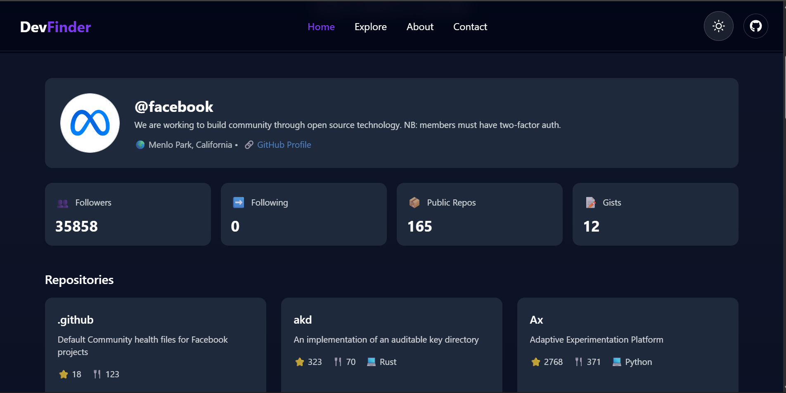

#  DevFinder

A modern GitHub user and repository explorer built with **React**, **Tailwind CSS**, and the **GitHub API**.

---

##  Features

- 🔎 Search GitHub users in real time
- 👤 View developer profiles with avatars and bios
- 📦 Explore repositories with stars, forks, and languages
- ⚡ Fast data fetching using GitHub REST API
- 🌗 Dark / Light mode support
- 📱 Fully responsive UI design
- 🧩 Reusable React components

---

## 🛠️ Tech Stack

- React (Vite)
- Tailwind CSS
- Axios
- GitHub REST API
- Context API (Theme management)

---

## 📡 API Used

GitHub Users API:
https://api.github.com/users/{username}

GitHub Repositories API:
https://api.github.com/users/{username}/repos

---

## 📸 Preview

![Explore]

---

## 👨‍💻 Author

Built by Adeyanju Ayotomide

GitHub: https://github.com/teecodes-dev
LinkedIn: https://ng.linkedin.com/in/adeyanju-ayotomide
Email: ayotomideadeyanju@gmail.com

---

## 📜 License

This project is open source and available under the MIT License.

---

## ⭐ Acknowledgements
GitHub API for providing developer data
React community for tools and ecosystem
Tailwind CSS for modern styling system